# Toolpaths

## -- IN DEVELOPMENT -- closed beta release--

Toolpaths is a Grasshopper plugin for generating and simulating G-code. Its goal is to enable new ways of 3D printing and CNC milling while giving novices and experts alike full control of the machines movement.

## Toolpaths core features

- **Object-Oriented Toolpaths**  
The core data type is the Toolpath, which encapsulates a curve with its associated metadata (speed, extrusion, etc.) into a single object.  
*Granularity*: Assign parameters per-path or per-segment.  
*Compatibility*: A Toolpath object remains a standard Grasshopper geometry type, allowing you to use native components for transformations without losing metadata.
- **Inheritance & Settings**  
Settings follow a simple priority: **Global Defaults** (lowest) → **Linked Template** → **Local Override** (highest). You can use any existing toolpath as a template for a new one, inheriting all properties automatically and overriding only what is necessary.
- **Simulation**  
The FDM engine simulates material deposition rather than just visualizing a mesh pipe. By calculating volume buildup the solver enables features like automatic flow adjustment.

#### Features FDM

- Variable layer height and vase mode slicing.
- Automatic extrusion width calculation and volume-based extrusion modes.
- Generator Components for infill and walls 
- Modulators: Per-vertex control of extrusion parameters like flow, speed, etc
- Masking: Filters to isolate modulator effects to specific sections of a toolpath.
- Path optimization via TSP sorting 
- Real-time playback of the simulation
- UV-mapped output meshes for rendering 
- Z-hop and retractions
- Gcode upload for Klipper, RepRap, and Octoprint.

#### Features CNC (currently not publicly available)

- LinuxCNC and Fusion 360 tool library support with tool/holder visualization
- High-performance stock removal simulation
- LinuxCNC-flavor G-code compiler

### Installation + Licensing

- run `_PackageManager`  > check include Pre-Releases > search for TOOLPATHS > install
- choose trial or cloud key > paste your key  > activate it

For more details, please refer to the [Licensing Documentation](Docs/CORE/licensing.md).

## Quickstart


- **FDM Toolpath:** The central component which defines the toolpath for the printer. Right-click to reveal properties that can be defined on a per-object level.
- **FDM Extruder:** Set extruder number, nozzle diameter, filament diameter and preview color.
- **FDM Machine:** bundles all settings for the individual printer. 
- **FDM Defaults:** enables global default values for all toolpaths that are not set on a per-object level.  Right-Click to reveal properties 
- **FDM Processor:** combines all toolpaths and settings into one program that is past to simulation or gcode output
- **FDM Simulator:** creates a mesh preview
- **FDM G-Code Output:** compiles the final G-Code and uploads it to the printer

## Toolpath Component

The central Component of the plugin is the toolpath component. It combines the printing path and settings that should be applied to it. 


Right click the component icon to reveal all parameters that can be set for this toolpath.   

The main input will be a curve, prefeably a polyline. Curves other than polyline will be converted automatically with 0.3mm sampling. Alternatively another toolpath can be also used as an input.

## Toolpath Inheritance


Toolpath components can be chained, allowing one Toolpath component to use the output of another as its input. This makes it possible to group toolpaths and override selected settings while preserving others.

In the example above, the individual speeds of the two input toolpaths are kept, while the Z-Hop value is overwritten and set to **3.2** for both.

If a setting is not defined on the Toolpath component, the value from the **FDM Defaults** component is used.

This creates a simple inheritance model: define global values in **FDM Defaults**, override specific values on individual toolpaths, or overwrite values from existing toolpaths by passing them through the Toolpath input.

## Toolpath Geometry

 Toolpaths objects are geometry. you can transform them with the standart grasshopper components. (move, array, transform ...)  Parameters set at the toolpaths stay intact. 

## Extrusion Modes

TOOLPATHS has 4 extrusion modes which are different ways to define the amount of extruded material per mm linear movement. 


1. **Volume Mode:** This is the most direct way to control the extrusion. It defines the volume extruded per mm of linear movement. e.g., 3 mm³/1 mm meaning 3 cubic millimeter extruded per one mm traveled. As layer height is actually the distance from the nozzle to the next layer it is not explicitly defined in this mode -- the FDM Simulator then uses the volume and actual distance to the layer below to create an accurate preview.
2. **Static Mode:** Sometimes the simulation of the extruded material is too heavy on large models and slows down the workflow. Static Mode disregards the distance to the next layer and uses explicitly defined width and height values. This allows for extrusions that occupy the same space in the preview when in reality the extrusion would actually squish.
3. **Auto Width Mode:** Automatically calculates the extrusion amount based on the height below the nozzle. Specify a target width, and the system computes the required extrusion volume to achieve it. This mode is particularly useful for non-planar printing applications where the layer height varies continuously. See Extrusion Calculation below for more details.
4. **Auto Ratio Mode:** Similarly to Auto Width Mode, it defines a target ratio between width and height and adjusts the extrusion amount accordingly.
5. **No Extrusion Mode:** The printer will follow this path but will not extrude any material.

**Flow:**  Flow acts like a multiplier on top of the chosen extrusion mode. In combination with e.g. Auto Width mode TOOLPATHS will calculate first the extrusion amount needed for the target width and then multiply it with the supplied flow value. Flow can be modulated with the Flow Modulator.

### Extrusion Calculation

TOOLPATHS simulates all extrusions in a global heightfield. The heightfield, extrusion calculation and preview mesh are tightly related.

  

 Settings for the heightfield are exposed in FDM Defaults:


- Heightfield Resolution: HFRes defines the resolution of the heightfield. Details smaller than this cannot be captured.
- Meshing Resolution: during simulation the toolpath is resampled based on this distance and at every point the heightfield is sampled. In Auto Width Mode the extrusion amount is calculated at every sample point.
- Smoothing Window: The preview mesh is slightly smoothed by default, as extrusion can not change instantly. Affects preview only.

#### Auto Extrusion and Degenerate Extrusion Detection

Auto Width Mode is convenient, but it can produce unintended results.

Example: the extrusion width is set to Auto Width 2 mm and the toolpath bridges over a gap. The algorithm evaluates the available height, which might be large (for example 10 cm if the bridge occurs higher in the print). Based on this, it attempts to deposit enough material so the extrusion approaches the target 2 mm width. This can lead to excessive material being extruded. Degenerate Extrusion Detection and layer-height limits are used to handle these cases by capping the amount of material that can be extruded.

#### Degenerate Behavior

A degenerate extrusion is an extrusion that has zero height or zero width. This can happen when a toolpath is too close to existing printed geometry. Degenerate modes handle zero-thickness points by either calculating replacement values from neighboring samples to maintain continuity (0) or flagging them as suppressed to omit them from the simulation (1).

##### Degenerate Aspect Ratio:

Extrusions with a width / height aspect ratio larger than this are considered degenerate.

##### Layerheight Minimum:

Extrusion with a layerheight smaller than this are considered degenerate.

##### Layerheight Maximum:

Extrusion with a layerheight larger than this are capped at this layerheight.

## Modulators

  
Modulators change a Toolpath after it has been created. They are used to vary parameters along a path or  reshape the path geometry. A modulator takes a Toolpath as input and outputs a new Toolpath with the modulation applied. Most modulators work per segment or per vertex. For example, the Flow Modulator writes a flow multiplier for every segment, while displacement modulators move the vertices of the Toolpath. 

Typical uses include:

- varying extrusion flow along a path
- changing print speed per segment
- changing extruder temperature along a path
- displacing a path with vectors, normals, or an interpolated vector field

Numeric modulators such as Flow, Speed, and Extruder Temperature use a shared mapping system. A single value can be applied to the whole Toolpath, or a list of values can be mapped onto the path using a Vertex Mapping Strategy.


**Vertex Mapping Strategies:**

- **Constant**: use the first value everywhere
- **OneToOne**: one value for every vertex
- **Wrap**: repeat the value list along the path
- **RepeatLast**: use the final value after the list runs out
- **Normalized-Stepped**: distribute values along the normalized length of the path in steps
- **Normalized-Interpolated**: interpolate smoothly between values along the normalized length of the path

## Masks


Masks control the strength of a modulator along a Toolpath. They are lists of numeric values, usually mapped per segment or per vertex.

Common values:

- 0 = no effect
- 1 = full effect
- 0..1 = blended effect

Some modulators clamp masks to 0..1. Others use the mask as a direct multiplier, so values above 1 can amplify the effect and negative values can invert it. For predictable results, use 0..1 unless overdriving is intentional.

Masks do not modify Toolpaths by themselves. They are connected to modulators to restrict, fade, or scale effects, for example by region or along a gradient.

## Generators

Toolpaths is built to give designers fine-grained control at the level of individual extrusions. It does not focus on automatic slicing or fully automated toolpath generation. Instead, users define and design the curves themselves.

To support this workflow, Toolpaths includes a small set of curve-generation components called **Generators**. Generators output **polylines**, not Toolpath objects.

## 2D Generators

### Infill Generator

### 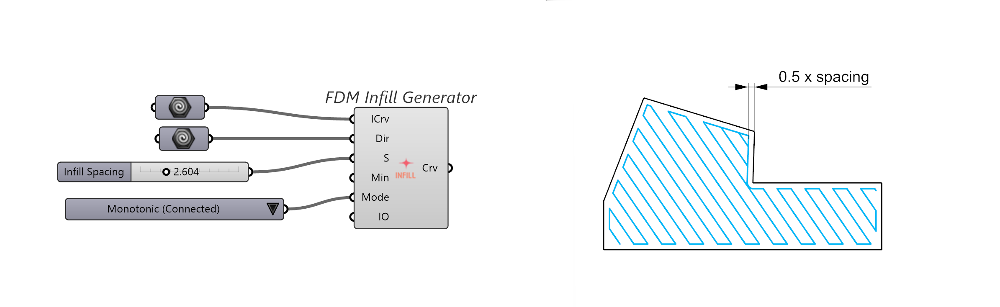

The Infill Generator fills a planar polygon with different patterns like Gyroid or Monotonic infill. By default the input region is offset inwards by half infill spacing to avoid overlapping between walls and infill. Adjust the offset by adding an input to Infill Offset.

### Walls Generator

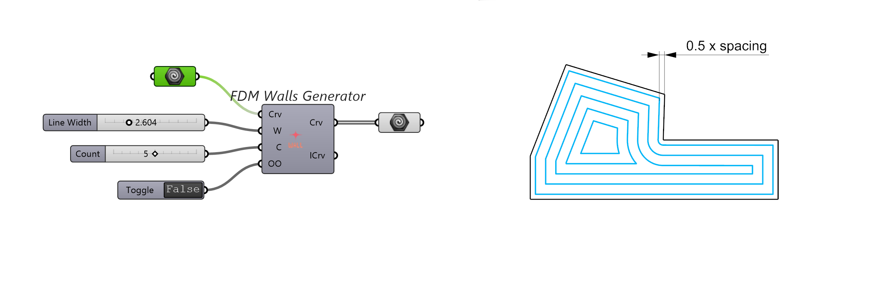

The Walls Generator creates multiple inward offsets of the input polygon. The first offset is positioned at 0.5 × line width from the polygon boundary, ensuring the extrusion fills up to the edge without overlap.

Walls Generator can also be used for outward offsets or with explicit values. Right click the component for options.

### Walls + Infill

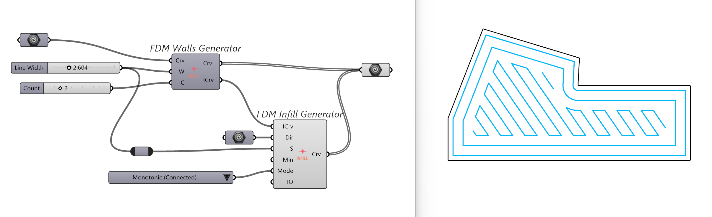

The Walls and Infill Generators can be used in combination to fill a polygon: Connect the Infill Curves output from the Walls Generator to the Infill Generator.

## 3D Generators

## Planar Slice Generator

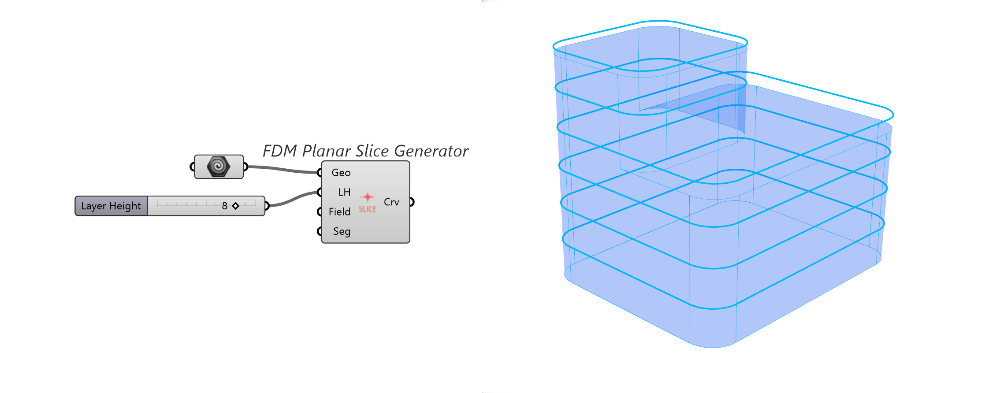

The Planar Slice Generator slices the input geometry into horizontal layers. Intersections are calculated at each layer’s midpoint, but the output polylines are placed at the layer ceiling. This matches the actual extrusion behavior: the nozzle deposits material downward, so the middle of the printed layer aligns with the intersection plane.

Brep-Plane intersection curves are resampled and output as polylines. Convert the input to mesh for faster slicing.

## Vase Mode Generator

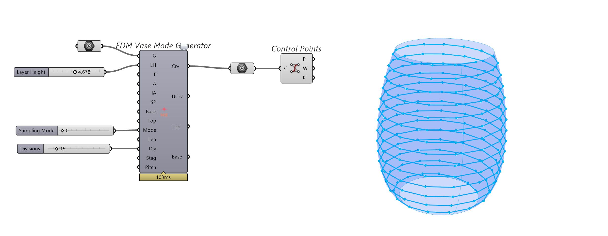

The Vase Mode Generator creates a helical path on the surface of the input geometry. The output curve is also resampled either by length (sampling mode = 1, default) or angle (sampling mode = 0). Length-based sampling produces consistent distances between sampling points. Angle-based sampling results in vertically aligned control points.

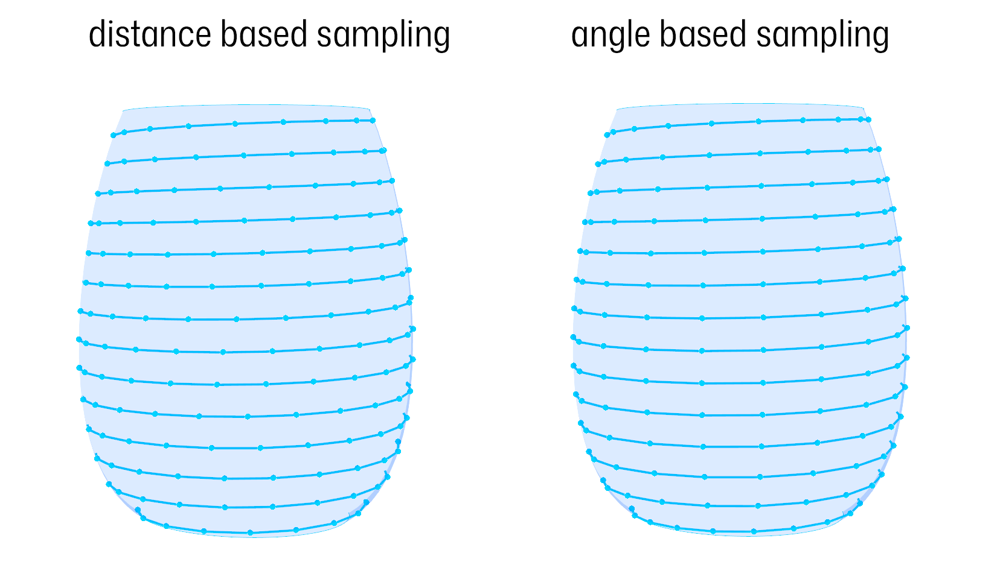

Angle based sampling can be staggered so that the pattern alternates and  repeats every N layers. Stagger can be combined with e.g. the Normal Displacement Modifier to create seamless surface patterns. 

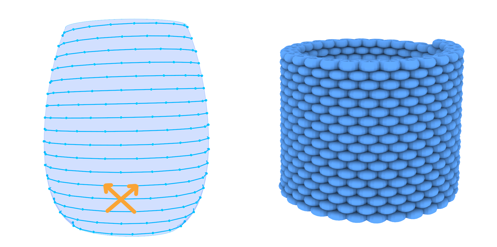

Base and top thickness can be used to slice the start end end of the shape planar -- commonly used to create a solid bottom layer.

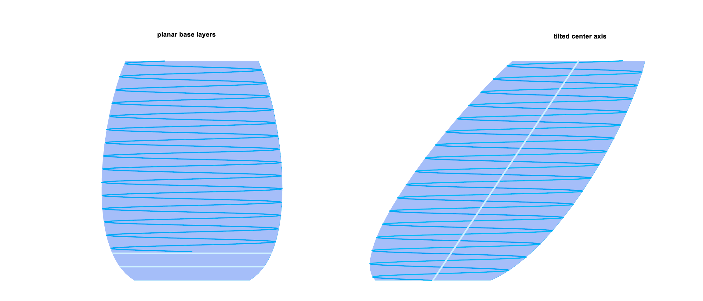

Center axis is usually infered by the bounding box center and  straight in Z direction. For slanted intput geometry it might be useful to explicitly define a tilted axis. 

## Layerheight Field

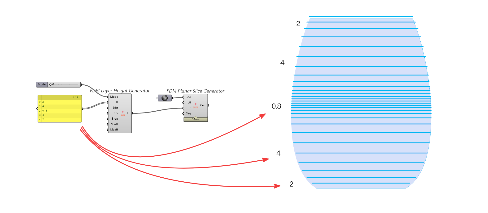

Vase Mode Generator and Planar Slice Generator can produce varieing layer heights based on a Layer Height Field. Use the Layer Height Generator to create fields based on interpolation of explicit values or on the slope of an input geometry. The number of output layers is automatically determen to achive the target density. 

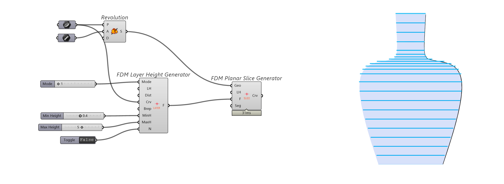

A profile curve, together with minimum and maximum layer height values, can be used to vary layer height based on slope. By default, the mapping is absolute: horizontal areas map to `MinH`, and vertical areas map to `MaxH`.

Enable Normalize Input by right-clicking the Layer Height Generator to remap the actual slope or curvature range of the input geometry to the full `[MinH..MaxH]` range. This makes the layer height variation relative to the geometry itself, rather than to an absolute horizontal-to-vertical range.

## Non-Planar Slicing

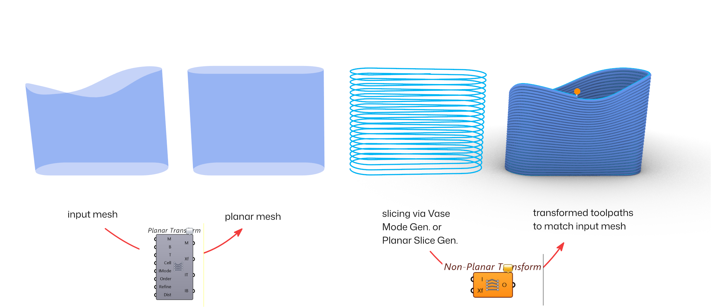

Non-planar slicing uses a two-step transform. First, the input mesh is transformed into a planar version with flat top and bottom boundaries. This allows standard slicing methods, such as Vase Mode or Planar Slicer, to generate regular toolpaths. After slicing, the inverse transform is applied to the toolpaths, bending them back into the original shape of the input mesh.  

### Planar Transform

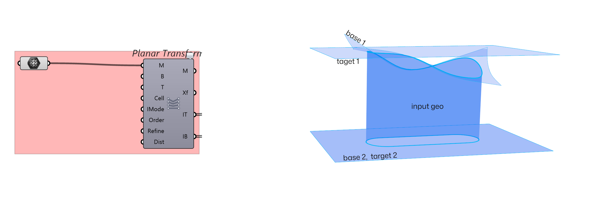

The first step is to transform the geometry so that the layer lines become horizontal in the transformed state. This is commonly used to align layer lines with a non-planar upper edge.

The **Planar Transform** component takes a mesh and a set of base and target surfaces, then deforms the mesh accordingly. Base and target surfaces can be supplied explicitly. If they are left empty, the component infers them from the input mesh:

```
**Base Surface 1:** a fitted surface through the upper naked edge of the mesh  
**Base Surface 2:** a horizontal planar surface at the bounding box minimum  
**Target Surface 1:** a horizontal planar surface at the bounding box maximum  
**Target Surface 2:** a horizontal planar surface at the bounding box minimum
```

With these defaults, the transform enlarges the input geometry in the transformed state. After slicing, the inverse transform compresses the generated toolpaths back onto the original shape. As a result, the layer height used in the transformed state becomes the maximum layer height after the inverse transform.

### Slicing and Inverse Transform

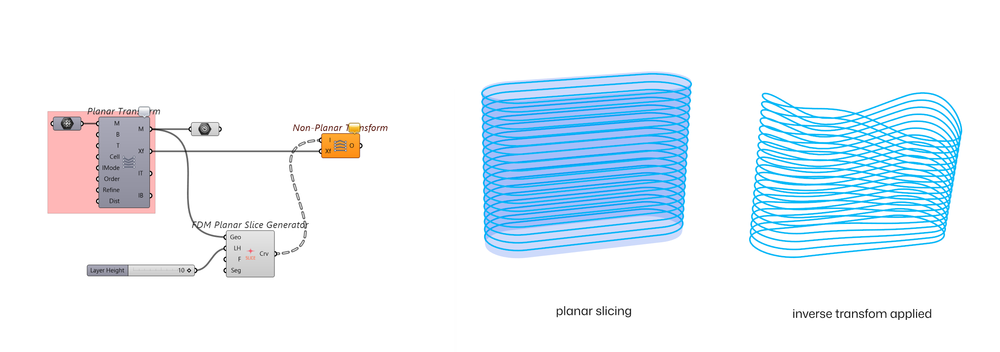

The transformed mesh can then be sliced with planar methods. The resulting toolpaths are transformed back using the inverse of the initial transform, so they conform to the original input geometry.

## Beta Testing

TOOLPATHS is currently in closed beta. We are beta testing with a small team of dedicated designers and fabricators. If you want to contribute, ask for a key at [toolpaths@juengerkuehn.com](mailto:toolpaths@juengerkuehn.com).

#### Changelog

###### 0.2.16-beta16

- multi extruder support
- when multiple files are open, only the preview of the current file is displayed
- less verbose messages on different components and on startup
- bug fixes for simulation time

###### 0.2.15-beta15

- rewrite for vase mode: 4 modes to control pitch and point spacing by angle or distance. removes the 400,001 vertex limit.
- Non-planar slicing: mesh is transformed to planar, sliced, and inverse-transformed to original geometry.
- Upgraded to .NET 8.0: requires Rhino 8.20+ for improved performance.
- Fixed bug causing incorrect infill line heights.

###### 0.2.13-beta13

- package layout for Rhino 7

###### 0.2.12-beta12

- async solver for FMD processor and FDM simulator
- rhino 7 support
- added gyroid and gyroid connected infill
- BREAKING CHANGES:
  - infill generator: "Line width" renamed to "Infill spacing"

###### 0.2.11-beta11

- handles flow = 0 and generates endcaps dynamically at extrusions ends
- more aggressive smoothing, suggested value for mesh smoothing is 0 - 2

###### 0.2.10-beta10

- output for robots (for use with e.g. robots plugin by visose)
- operations are removed and replaced by toolpath inheritance
- toolpath can accept other toolpaths as templates. In this way settings can be used in multiple toolpaths and  adjusted in bulk 
- new curve / toolpath sorting component, sorting is removed in the FDM Processor
- machine and process settings are separated: FDM machine + FDM Defaults
- FDM Processor checks the build volume, if provided, and gives visual warnings if exceeded
- Z clearance setting check initial Z hop to prevent collisions

###### 0.2.9-beta9

- non-planar example
- Renamed "Initial Z Height" to Safe Clearance: Max(CurrentZ + Clearance, Clearance) logic
- renaming in fdm defaults: StartG → startG-Code, EndG → endG-Code, EPos → ExtruderMode
- fdm simulator: outputs overall program time in human readable format: HH:mm:ss
- vector field modulator: replaced IDW with Gaussian for smoother   displacement
- vector field modulator: introduced per-point "Sigma" radius for individual influence control (removed redundant Falloff)

###### 0.2.1-beta1 to 0.2.8-beta8

- bug fixes
- auto segmentation for curve inputs
- modulated speeds for no extrude moves will be correctly displayed
- gcode output to GH only on request
- faster slicing 
- image map example 
- variable infill example
- better degen defaults
- issue warnings if extrusion is limited by nozzle size
- slicing component now accept mesh input (much faster)
- baked preview mesh is now split to match the sim time
- improved stability 
- deconstruct toolpath is now two components: deconstruct CNC and deconstruct FDM
- gha loading sequence fix on mac 
- no extrude curves displayed thicker

###### 0.2.0-beta0

- mesh smoothing 
- refactored infill and wall generator
- modulators accepts linear curves
- demo files
- volume component to calculate the extrusion area based on width / height
- static mode more performant

###### 0.1.14-alpha15

- fdm machine flattens toolpath input
- uv scaling input  for better textures flow along the extrusion
- bugfixes for preview

###### 0.1.13-alpha14

- Infill Generator : robust handling for disjoint regions
- Infill Generator :  Start Point is now hidden ; right click to reveal
- smart selector for extrusion mode based on available inputs 
- bugfix: static mode now correctly ignores sampled heights
- closed paths are rendered more nicely

###### 0.1.12-alpha13

- toolpaths now has an icon

###### 0.1.11-alpha12

- interpolated vector field modulator
- simulation improvement:
  - heightfield outlier filtering
  - extrusion smoothing 
  - degenerate extrusion filtering
  - heightfield interpolation
- bugfix: sorting curves off by default
- icons for parameters
- deconstruct toolpath features hidden outputs for clarity
- color component features hidden inputs
- vms now should default to 2 for all modulators

###### 0.1.10-alpha11

- significant perf improvements in fdm program generation and simulation

###### 0.1.9-alpha10

- better icons
- significant perf improvements in fdm preview

###### 0.1.8-alpha9

- icons
- curve divider respects closed/open state
- walls generator reworked to suppress duplicate control points
- introduction of simplify curve component

###### 0.1.7-alpha8

- planar slicer component: generates planar curves for "normal" printing
- bugfix in walls generator: holes are offset correctly

###### 0.1.6-alpha7

- async upload to printer
- refactor of vasemode layerheight 
- introduction of layerheight generator: creates a layerheights based on slope 
- better default values
- licensing popup when license is expired

###### 0.1.5-alpha6

- option to disable licensing , plugin will not try to load automatically until licensing is enabled
- naming conflict resolved between Rhino host plugin and Grasshopper

###### 0.1.4-alpha5

- licensing popup at first install