Toolpaths is a Grasshopper plugin for generating and simulating G-code. Its goal is to enable new ways of 3D printing and CNC milling while giving novices and experts alike full control of the machine's movement.

## Toolpaths core features

- **Object-Oriented Toolpaths**

The core data type is the Toolpath, which encapsulates a curve with its associated metadata (speed, extrusion, etc.) into a single object.  
*Granularity*: Assign parameters per-path or per-segment.  
*Compatibility*: A Toolpath object remains a standard Grasshopper geometry type, allowing you to use native components for transformations without losing metadata.

- **Toolpath Inheritance**

Settings follow a simple priority: **FDM Defaults** (lowest) → **inherited Toolpath settings** → **local Toolpath overrides** (highest). Connect one Toolpath to another to inherit its settings, then override only the values that need to change.

- **Simulation**

The FDM engine simulates material deposition rather than just visualizing a mesh pipe. By calculating volume buildup the solver enables features like automatic flow adjustment.

## Install TOOLPATHS

1. Request a trial key at [toolpaths@juengerkuehn.com](mailto:toolpaths@juengerkuehn.com).
2. In Rhino, run `_PackageManager`, enable **Include pre-releases**, search for **TOOLPATHS**, and install it.
3. When the licensing dialog opens, paste your trial key under **License key — local or trial** and click **Activate license**. To use a Rhino account license instead, choose **Rhino account — Cloud Zoo** and click **Continue with Rhino**.

See the [licensing guide](deprecated/Docs/CORE/licensing.md) for other license types and details.

# Quickstart

A **Toolpath** combines geometry with the properties used to print it. The **FDM Processor** collects the Toolpaths, applies defaults and machine settings, and creates one program. The **FDM Simulator** displays that program as a mesh, and **FDM G-Code Output** writes the program as G-code.

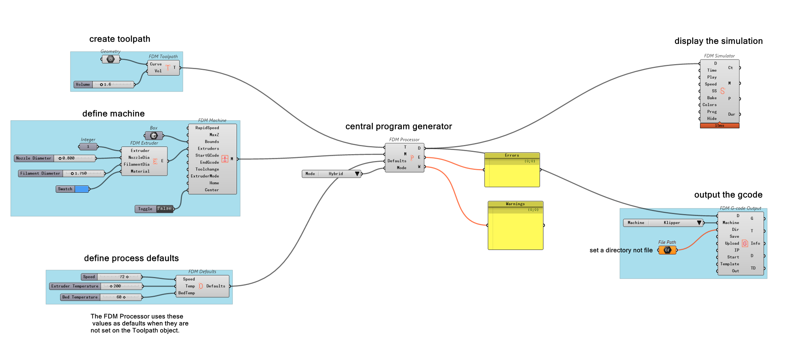

[Download the Quickstart Grasshopper definition](docs-v3/examples/quickstart.gh) to explore the complete workflow.

### Vase Mode Example

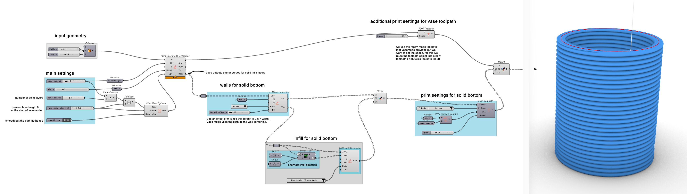

This example shows a vase-mode print with a solid bottom. The Vase Mode Generator creates the helical wall path and can also output planar base curves. These curves are used with the Walls and Infill Generators to fill the bottom. The definition also shows additional Toolpath settings and options such as staggering.

[Download the Vase Mode Grasshopper definition](docs-v3/examples/vasemode.gh)

## Main Components

FDM Toolpath

The **FDM Toolpath** combines a curve with printing properties such as extrusion volume. Right-click the component to reveal its optional property inputs.

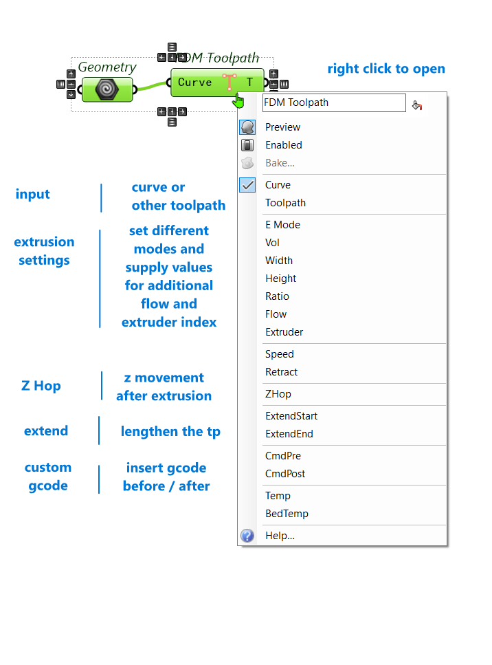

Connect a curve to the `Curve` input; a polyline is recommended. Other curve types are automatically converted to polylines with 0.3 mm sampling. You can also connect another Toolpath to inherit its settings.

### Toolpath Inheritance

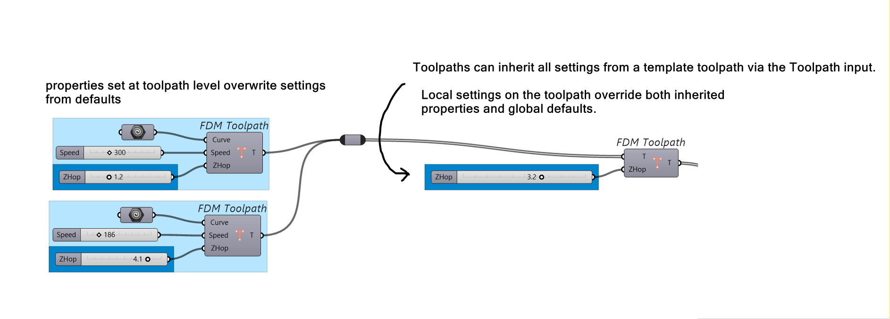

Toolpath components can be chained. A Toolpath inherits settings from the Toolpath connected to its input, then applies its own local overrides.

In the example, each Toolpath keeps its own speed, while the Z-Hop value is set to **3.2** for both.

If a property is not set locally or inherited from the connected Toolpath, the value from **FDM Defaults** is used.

### Toolpath Geometry

Toolpaths are geometry, so you can transform them with standard Grasshopper components such as Move, Array, and Transform. Toolpath properties stay attached through these transformations.

### Extrusion Modes

TOOLPATHS has five extrusion modes. They define how much material is deposited for each millimeter of travel, or specify that no material is deposited.

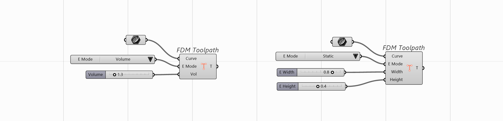

1. **Volume Mode:** Sets the volume of material deposited per millimeter of travel. For example, `3 mm³/mm` deposits 3 mm³ of material for every millimeter traveled. The simulator uses the volume and the height of the material below the nozzle to calculate the preview geometry.
2. **Static Mode:** Sets a fixed extrusion width and height. The simulation does not adapt the extrusion shape to the height of the material below the nozzle. This can be faster for large models.
  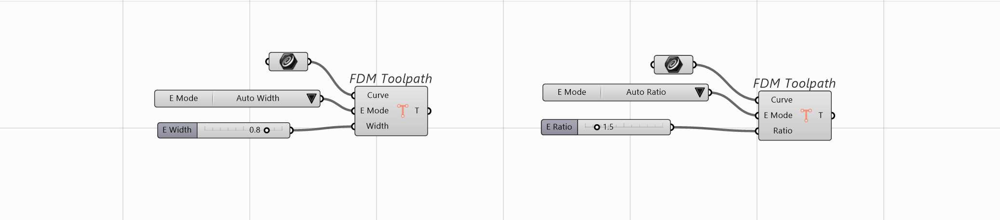
3. **Auto Width Mode:** Sets a target extrusion width. TOOLPATHS calculates the required volume from the available height below the nozzle. This is useful when layer height varies, such as in non-planar printing.
4. **Auto Ratio Mode:** Sets a target ratio between extrusion width and height. TOOLPATHS adjusts the extrusion volume to maintain that ratio.
5. **No Extrusion Mode:** Moves the printer along the path without depositing material.

**Flow** multiplies the extrusion amount calculated by the selected mode. For example, Auto Width Mode first calculates the volume needed to reach the target width, then applies the Flow multiplier. Flow can also be varied along the path with the Flow Modulator.

Extrusion Calculation

TOOLPATHS simulates all extrusions in a global heightfield. The heightfield, extrusion calculation and preview mesh are tightly related.

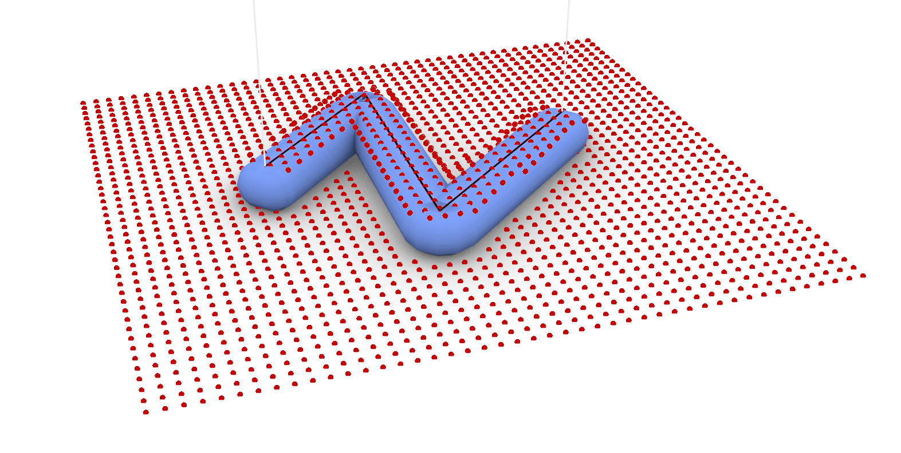

 Settings for the heightfield are exposed in FDM Defaults:

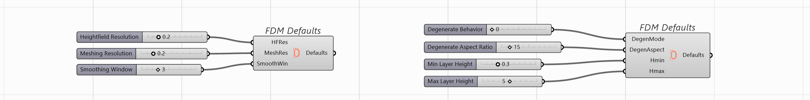

- Heightfield Resolution: HFRes defines the resolution of the heightfield. Details smaller than this cannot be captured.
- Meshing Resolution: during simulation the toolpath is resampled based on this distance and at every point the heightfield is sampled. In Auto Width Mode the extrusion amount is calculated at every sample point.
- Smoothing Window: The preview mesh is slightly smoothed by default, as extrusion cannot change instantly. Affects preview only.

#### Auto Extrusion and Degenerate Extrusion Detection

Auto Width Mode is convenient, but it can produce unintended results.

Example: the extrusion width is set to Auto Width 2 mm and the toolpath bridges over a gap. The algorithm evaluates the available height, which might be large (for example 10 cm if the bridge occurs higher in the print). Based on this, it attempts to deposit enough material so the extrusion approaches the target 2 mm width. This can lead to excessive material being extruded. Degenerate Extrusion Detection and layer-height limits are used to handle these cases by capping the amount of material that can be extruded.

#### Degenerate Behavior

A degenerate extrusion is an extrusion that has zero height or zero width. This can happen when a toolpath is too close to existing printed geometry. Degenerate modes handle zero-thickness points by either calculating replacement values from neighboring samples to maintain continuity (0) or flagging them as suppressed to omit them from the simulation (1).

##### Degenerate Aspect Ratio:

Extrusions with a width / height aspect ratio larger than this are considered degenerate.

##### Minimum Layer Height

Extrusions with a layer height smaller than this are considered degenerate.

##### Maximum Layer Height

Extrusions with a layer height larger than this are capped at this height.

FDM Machine

The **FDM Machine** bundles the static settings that describe the 3D printer.

| Setting          | Description                                                                                                                                      |
| ---------------- | ------------------------------------------------------------------------------------------------------------------------------------------------ |
| **Rapid Speed**  | Travel speed for non-printing moves.                                                                                                             |
| **Max Z Speed**  | Maximum speed for Z-axis moves, including Z-hops.                                                                                                |
| **Bounds**       | The printer's build volume. Connect a Box.                                                                                                       |
| **Extruders**    | Connect one or more FDM Extruder components to define each extruder's index, nozzle and filament diameters, and material color.                  |
| **Start G-code** | Supply custom startup G-code. If none is supplied, TOOLPATHS generates basic initialization code; check that it is compatible with your printer. |
| **End G-code**   | Supply custom shutdown G-code. By default, TOOLPATHS moves up by the Z clearance distance and turns off the heaters.                             |
| **Toolchange**   | G-code to run at each toolchange. Use `[next_extruder]` for the next extruder index, for example `T[next_extruder]`.                             |
| **Center**       | Moves the print to the center of the build plate.                                                                                                |

FDM Defaults

**FDM Defaults** provides global process settings to the FDM Processor. These values are used when a Toolpath does not define or inherit the corresponding property. Right-click the component to add optional inputs.

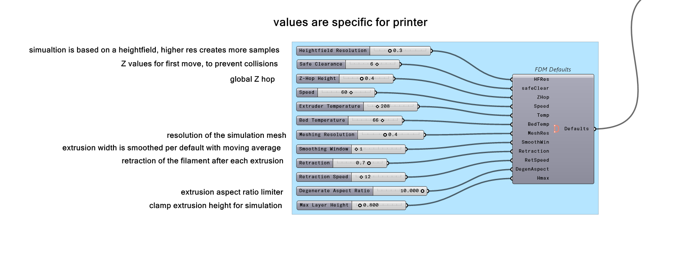

| Setting                      | Nickname      | Description                                                                                                                                                   |
| ---------------------------- | ------------- | ------------------------------------------------------------------------------------------------------------------------------------------------------------- |
| **E Mode**                   | `Mode`        | Default extrusion mode: `0` Volume, `1` Auto, `2` Auto Ratio, `3` Static, `4` No Extrusion.                                                                   |
| **Safe Clearance**           | `safeClear`   | Clearance used for program entry and exit. The target is the greater of current Z plus clearance or the clearance value; min/max Z-Hop limits apply when set. |
| **Z-Hop Height**             | `ZHop`        | Default height for Z-hop moves between Toolpaths.                                                                                                             |
| **Min Z-Hop Height**         | `ZHopMin`     | Absolute minimum height for Z-hop moves, in millimeters.                                                                                                      |
| **Max Z-Hop Height**         | `ZHopMax`     | Absolute maximum height for Z-hop moves, in millimeters.                                                                                                      |
| **Speed**                    | `Speed`       | Default speed for extrusion moves, in millimeters per second.                                                                                                 |
| **Extruder Temperature**     | `Temp`        | Target extruder temperature.                                                                                                                                  |
| **Bed Temperature**          | `BedTemp`     | Target bed temperature.                                                                                                                                       |
| **Heightfield Resolution**   | `HFRes`       | Heightfield cell size, in millimeters. Smaller values capture finer detail at the cost of more computation.                                                   |
| **Meshing Resolution**       | `MeshRes`     | Spacing used when sampling intermediate points for the simulation mesh.                                                                                       |
| **Smoothing Window**         | `SmoothWin`   | Number of samples used by the Gaussian smoothing window.                                                                                                      |
| **Retraction**               | `Retraction`  | Default retraction distance, in millimeters.                                                                                                                  |
| **Retraction Extra Restart** | `RetExtra`    | Extra filament to push during unretraction, in millimeters.                                                                                                   |
| **Retraction Speed**         | `RetSpeed`    | Retraction speed, in millimeters per second.                                                                                                                  |
| **Unretraction Speed**       | `UnretSpeed`  | Unretraction speed, in millimeters per second. If unset, the retraction speed is used.                                                                        |
| **Degenerate Behavior**      | `DegenMode`   | How to handle degenerate samples: `0` interpolates from neighboring samples; `1` suppresses extrusion.                                                        |
| **Degenerate Aspect Ratio**  | `DegenAspect` | Width-to-height ratio above which an extrusion sample is considered degenerate.                                                                               |
| **Width Clamp**              | `WClamp`      | Nozzle-based width allowance for the aspect-ratio check. `0` disables this clamp; positive values set the allowance as a multiple of nozzle diameter.         |
| **Min Layer Height**         | `Hmin`        | Minimum layer height in millimeters. Samples below this are treated as degenerate; `0` uses the nozzle-based default.                                         |
| **Max Layer Height**         | `Hmax`        | Maximum layer height in millimeters. In Auto mode, extrusion is limited to stay within this height; `0` uses the nozzle-based default.                        |

The component outputs one **Defaults** object. Connect it to the `Defaults` input of the FDM Processor.

FDM Processor

The **FDM Processor** resolves Toolpaths, machine settings, and process defaults into one program and provides the data needed for simulation and output.

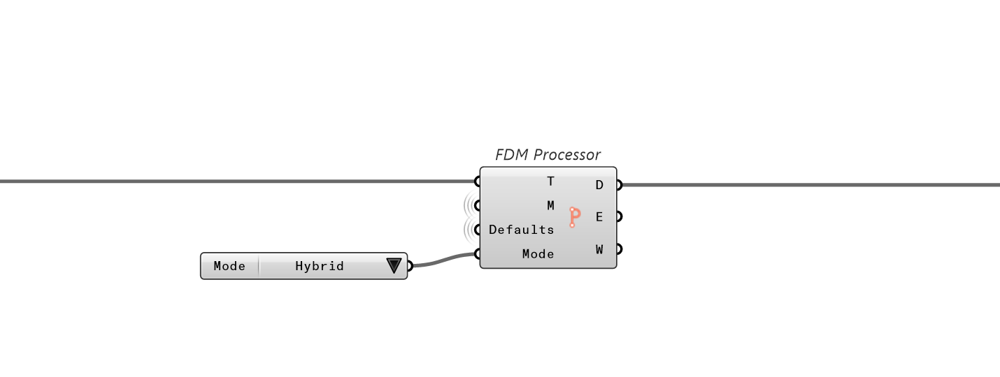

Inputs

| Input              | Nickname   | Default      | Description                                                         |
| ------------------ | ---------- | ------------ | ------------------------------------------------------------------- |
| **Toolpaths**      | `T`        | —            | Toolpaths to combine into the program. Accepts a tree of Toolpaths. |
| **Machine**        | `M`        | —            | Optional FDM Machine settings.                                      |
| **Defaults**       | `Defaults` | —            | Optional FDM process defaults.                                      |
| **Processor Mode** | `Mode`     | `2` (Hybrid) | Selects preview and simulation behavior.                            |

Processor Modes

| Value | Mode           | Description                                                                                                                               |
| ----- | -------------- | ----------------------------------------------------------------------------------------------------------------------------------------- |
| `0`   | **Simulation** | Runs the full simulation. Simulation data is available for playback and export.                                                           |
| `1`   | **Preview**    | Builds a fast preview. G-code, robot, and other export outputs are unavailable in this mode.                                              |
| `2`   | **Hybrid**     | Shows a fast preview first, then replaces it with the full simulation. Export outputs become available when the full simulation finishes. |

Outputs

| Output              | Nickname | Description                                                                            |
| ------------------- | -------- | -------------------------------------------------------------------------------------- |
| **Simulation Data** | `D`      | Program and simulation data. Connect this to the FDM Simulator or an output component. |
| **Errors**          | `E`      | Errors reported while building the program.                                            |
| **Warnings**        | `W`      | Warnings reported while building the program.                                          |

FDM Simulator

The **FDM Simulator** displays the program as a mesh preview and provides controls for playback and visualization.

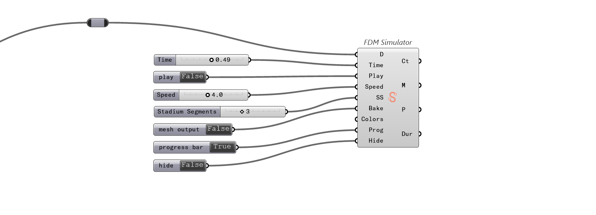

Inputs

| Input                | Nickname | Default | Description                                                                      |
| -------------------- | -------- | ------- | -------------------------------------------------------------------------------- |
| **Simulation Data**  | `D`      | —       | Simulation data from the FDM Processor.                                          |
| **Time**             | `Time`   | `1.0`   | Simulation position, from `0.0` (start) to `1.0` (end).                          |
| **Play**             | `Play`   | `False` | Plays the simulation in real time.                                               |
| **Speed**            | `Speed`  | `1.0`   | Playback speed multiplier.                                                       |
| **Stadium Segments** | `SS`     | `3`     | Number of segments used for the stadium extrusion profile.                       |
| **Bake Meshes**      | `Bake`   | `False` | Outputs combined meshes to Grasshopper when enabled.                             |
| **Colors**           | `Colors` | —       | Optional color and material settings.                                            |
| **Progress Overlay** | `Prog`   | `True`  | Shows a viewport progress overlay while the processor or simulator calculates.   |
| **Disable Preview**  | `Hide`   | `False` | Disables viewport previews and conduits when enabled.                            |
| **UV Scale**         | `UVs`    | `0.01`  | Optional texture-coordinate scale. Add it from the component's right-click menu. |

Outputs

| Output               | Nickname | Description                                        |
| -------------------- | -------- | -------------------------------------------------- |
| **Current Time**     | `Ct`     | Current simulated time in seconds.                 |
| **Meshes**           | `M`      | Generated extrusion mesh chunks.                   |
| **Tool Position**    | `P`      | Current toolhead position.                         |
| **Program Duration** | `Dur`    | Total program duration in a human-readable format. |

FDM G-code Output

The **FDM G-code Output** component compiles the FDM program into machine-specific G-code. It can save the file to disk or upload it to a supported printer.

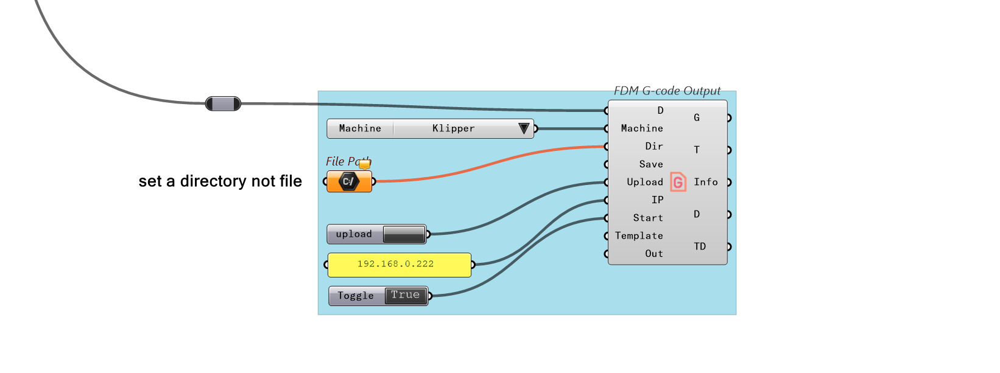

Inputs

| Input | Nickname | Default | Description |
| --- | --- | --- | --- |
| **Simulation Data** | `D` | — | Simulation data from the FDM Processor. Full simulation data is required to compile G-code. |
| **Machine Type** | `Machine` | Klipper | Selects the G-code target: Klipper, Klipper (No Z), RepRap, Prusa, or Bambu. |
| **Output Directory** | `Dir` | Desktop | Parent folder for saved output. Files are organized in a `toolpaths gcode` folder and then by date. |
| **Save** | `Save` | `False` | Saves the compiled G-code to disk. |
| **Upload** | `Upload` | `False` | Uploads the saved file to the selected printer. Upload also triggers saving. |
| **Printer IP Address** | `IP` | — | IP address of the printer used for upload. |
| **Start Print** | `Start` | `False` | Starts printing after upload, if supported by the machine. |
| **Template 3MF** | `Template` | — | For Bambu printers, path to a `.gcode.3mf` template file from Bambu Studio. |
| **Output G-code** | `Out` | `False` | Outputs the compiled G-code to Grasshopper. This can be slow for very large files. |

Outputs

| Output | Nickname | Description |
| --- | --- | --- |
| **G-code** | `G` | Compiled G-code when **Output G-code** is enabled. |
| **Toolpath** | `T` | Resulting toolpath geometry. |
| **Info** | `Info` | Save and upload status. |
| **Verbose Debug** | `D` | Detailed output of individual machine movements when **Output G-code** is enabled. |
| **Toolpath Debug** | `TD` | Summary of toolpath structure and properties when **Output G-code** is enabled. |

Modulators

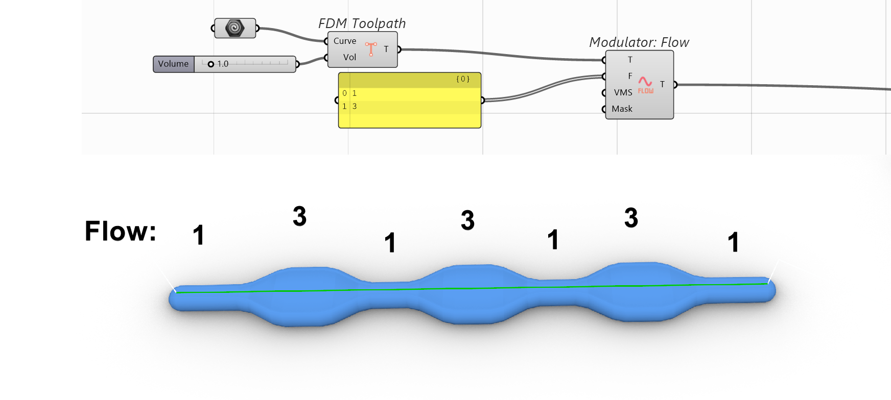

Modulators change a Toolpath after it has been created. They vary parameters along a path or reshape its geometry. A modulator takes a Toolpath as input and outputs a new Toolpath with the modulation applied. Most modulators work per segment or per vertex. For example, the Flow Modulator writes a flow multiplier for every segment, while displacement modulators move the Toolpath vertices.

Typical uses include:

- varying extrusion flow along a path
- changing print speed per segment
- changing extruder temperature along a path
- displacing a path with vectors, normals, or an interpolated vector field

Numeric modulators such as Flow, Speed, and Extruder Temperature use a shared mapping system. A single value can be applied to the whole Toolpath, or a list of values can be mapped onto the path using a Vertex Mapping Strategy.

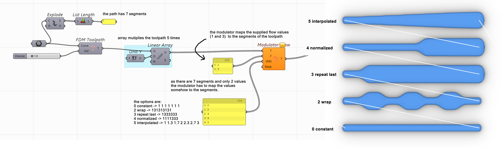

**Vertex Mapping Strategies:**

- **Constant**: use the first value everywhere
- **OneToOne**: one value for every vertex
- **Wrap**: repeat the value list along the path
- **RepeatLast**: use the final value after the list runs out
- **Normalized-Stepped**: distribute values along the normalized length of the path in steps
- **Normalized-Interpolated**: interpolate smoothly between values along the normalized length of the path

[Open the Flow Modulator example](Examples/toolpath_flow-modulator_beta-24.gh) to see per-segment flow control.

Masks

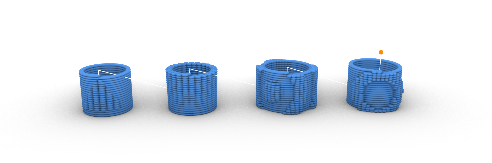

Masks control the strength of a modulator along a Toolpath. They are lists of numeric values, usually mapped per segment or per vertex.

Common values:

- 0 = no effect
- 1 = full effect
- 0..1 = blended effect

Some modulators clamp masks to 0..1. Others use the mask as a direct multiplier, so values above 1 can amplify the effect and negative values can invert it. For predictable results, use 0..1 unless overdriving is intentional.

Masks do not modify Toolpaths by themselves. They are connected to modulators to restrict, fade, or scale effects, for example by region or along a gradient.

Generators

Toolpaths is built to give designers fine-grained control at the level of individual extrusions. It does not focus on automatic slicing or fully automated toolpath generation. Instead, users define and design the curves themselves.

To support this workflow, Toolpaths includes a small set of curve-generation components called **Generators**. Generators output **polylines**, not Toolpath objects.

2D Generators

Infill Generator

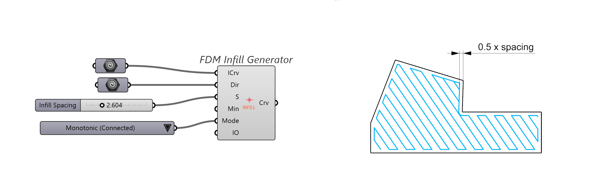

The Infill Generator fills a planar polygon with patterns such as Gyroid or Monotonic infill. By default, the input region is offset inward by half the infill spacing to avoid overlap between walls and infill. Adjust the offset through the Infill Offset input.

Walls Generator

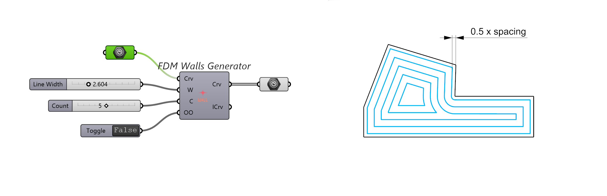

The Walls Generator creates multiple inward offsets of the input polygon. The first offset is positioned at 0.5 × line width from the polygon boundary, ensuring the extrusion fills up to the edge without overlap.

Walls Generator can also be used for outward offsets or with explicit values. Right-click the component for options.

Walls + Infill

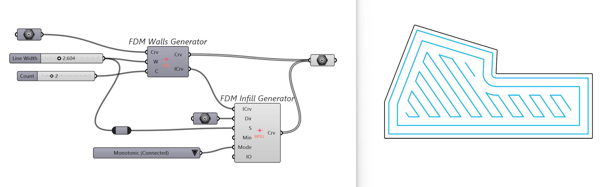

The Walls and Infill Generators can be combined to fill a polygon. Connect the Infill Curves output from the Walls Generator to the Infill Generator.

3D Generators

Planar Slice Generator

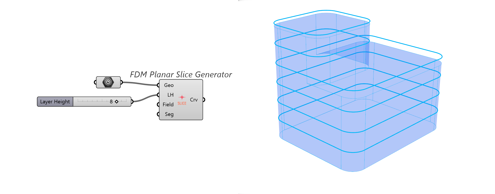

The Planar Slice Generator slices the input geometry into horizontal layers. Intersections are calculated at each layer’s midpoint, but the output polylines are placed at the layer ceiling. This matches the actual extrusion behavior: the nozzle deposits material downward, so the middle of the printed layer aligns with the intersection plane.

Brep-Plane intersection curves are resampled and output as polylines. Convert the input to mesh for faster slicing.

Vase Mode Generator

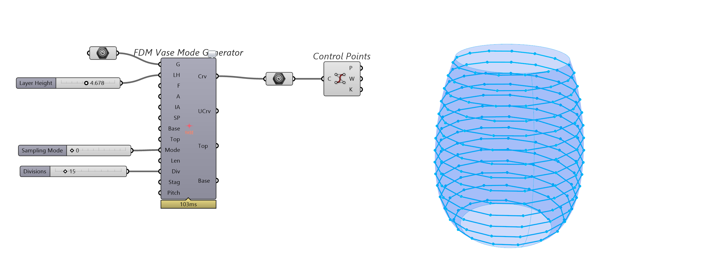

The Vase Mode Generator creates a helical path on the surface of the input geometry. The output curve is also resampled either by length (sampling mode = 1, default) or angle (sampling mode = 0). Length-based sampling produces consistent distances between sampling points. Angle-based sampling results in vertically aligned control points.

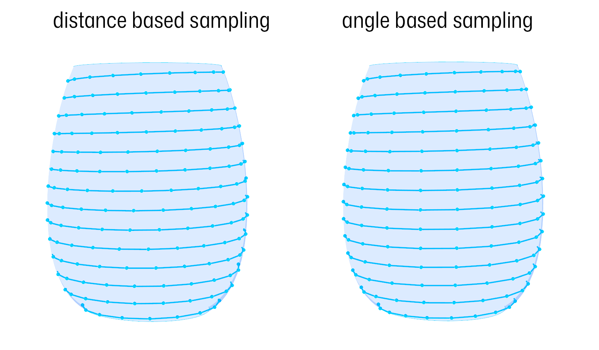

Angle-based sampling can be staggered so that the pattern alternates and repeats every N layers. Stagger can be combined with the Normal Displacement Modifier to create seamless surface patterns.

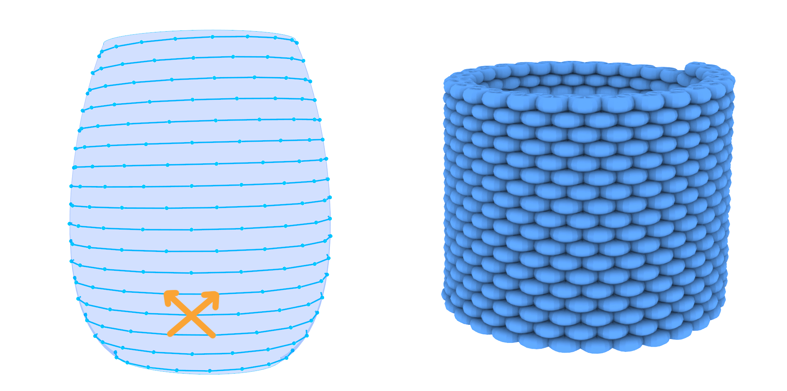

Base and top thickness can be used to slice the start and end of the shape into planar layers, commonly to create a solid bottom layer.

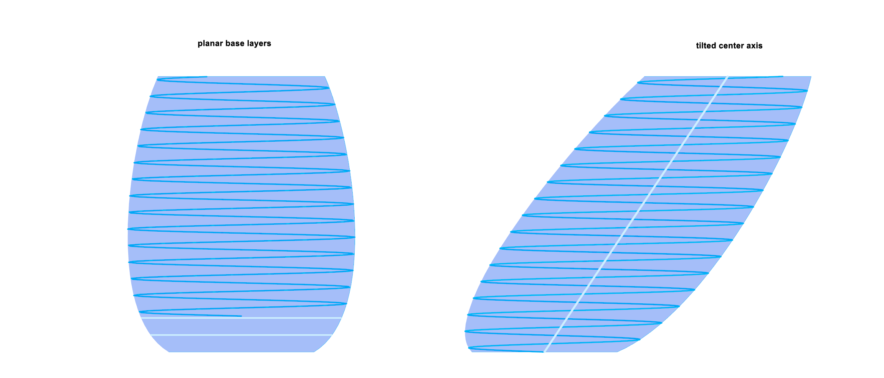

The center axis is usually inferred from the bounding box center and points straight in the Z direction. For slanted input geometry, it may help to define a tilted axis explicitly.

[Open the Vase Mode example](docs-v3/examples/vasemode.gh) to inspect the complete workflow.

Layer Height Field

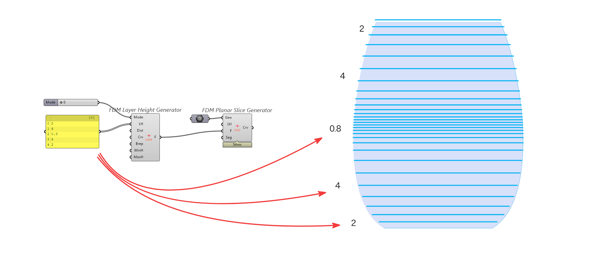

Vase Mode Generator and Planar Slice Generator can produce varying layer heights based on a Layer Height Field. Use the Layer Height Generator to create fields by interpolating explicit values or using the slope of input geometry. The number of output layers is automatically determined to achieve the target density.

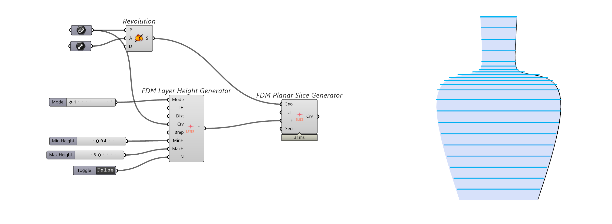

A profile curve, together with minimum and maximum layer height values, can be used to vary layer height based on slope. By default, the mapping is absolute: horizontal areas map to `MinH`, and vertical areas map to `MaxH`.

Enable Normalize Input by right-clicking the Layer Height Generator to remap the actual slope or curvature range of the input geometry to the full `[MinH..MaxH]` range. This makes the layer height variation relative to the geometry itself, rather than to an absolute horizontal-to-vertical range.

